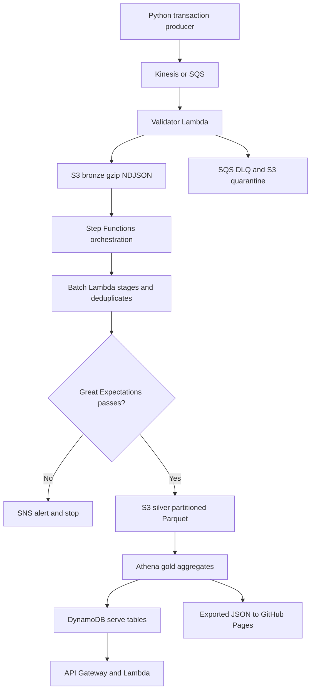

# Flowledger — Serverless Transaction Lakehouse

A runnable portfolio project for streaming + batch UPI/e-commerce analytics, designed for short AWS sessions within a $100 learning budget.

**Status:** the public dashboard is live on GitHub Pages and serves an exported AWS synthetic-data snapshot. GitHub Actions CI currently passes, including Python tests, LocalStack integration, Terraform validation, and TFLint. The AWS runtime is account/session dependent; dashboard availability does not mean the pipeline is continuously running.

## Live dashboard

[Open the Flowledger dashboard](https://ri460.github.io/upi-lakehouse/). The published snapshot was generated **2026-09-30 20:39 UTC** and reports **376 accepted unique transactions**, **₹853,722 revenue**, **1.9% flagged**, across **12 merchants**. It is a static JSON export, not a continuously refreshing view or a live API. The page is public and remains available after AWS teardown.

### AWS pipeline structure



| Stage | Components | What it does |
|---|---|---|
| Produce and ingest | `src/producer`, Kinesis Data Streams or SQS | Generates synthetic INR UPI/e-commerce transactions; SQS is the fallback ingestion path. |
| Validate and quarantine | Validator Lambda, SQS DLQ, S3 quarantine | Checks event shape and schema, rejects malformed records, and preserves failures for inspection/replay. |
| Bronze | S3 gzip NDJSON | Stores accepted raw events under date/hour partitions. |
| Batch and quality gate | Step Functions, batch Lambda, Great Expectations | Stages records, deduplicates replays, normalizes types, computes heuristic flags, and stops publication when checks fail. |
| Silver and gold | S3 Parquet, Glue Catalog, Athena | Publishes quality-approved silver partitions and builds merchant revenue, hourly flagged rate, and payment-method aggregates. |
| Serve | DynamoDB, API Gateway, Lambda | Makes transaction and merchant summary lookups available through IAM-authenticated routes. |
| Dashboard | `scripts/export_dashboard.sh`, `docs/dashboard.json`, GitHub Pages | Publishes a point-in-time aggregate snapshot as a static public page. |
| Operate | Terraform, GitHub Actions, CloudWatch, SNS, X-Ray | Provisions resources, checks code, and provides logs, alarms, and tracing. |

**Account-specific deployment note:** this AWS account's Organizations policy denied creation of the GitHub OIDC provider and denied Kinesis stream tagging. Use SQS mode for the demo unless an AWS administrator changes those restrictions. GitHub Pages publishing works; the AWS deploy workflow requires a permitted OIDC role and is not currently an unattended AWS deployment path. Confirm AWS resources and costs in the account before each session.

## Start locally

Python 3.12 recommended. From the extracted project directory:

```bash
python -m venv .venv
source .venv/bin/activate
# Windows PowerShell: .venv\Scripts\Activate.ps1
python -m pip install -r requirements.txt
python -m pytest -q
python -m src.local_demo --count 5000
```

Open the included dashboard (already populated with a measured local demo):

```bash
python -m http.server 8000 --directory docs
```

Visit http://localhost:8000. To replace its sample with your latest demo, copy `data/demo/dashboard.json` to `docs/dashboard.json` (`make demo` does both on macOS/Linux).

Docker alternative: `docker compose run --build --rm demo`. AWS-protocol integration: `docker compose up -d --wait localstack`, then `RUN_LOCALSTACK=1 python -m pytest tests/test_localstack.py -q`. Stop it with `docker compose down`. LocalStack integration is included but was not run in the authoring environment, which has no Docker daemon.

## Implemented

- Rate-controlled Python simulator, ~3% injected faults/replays, schema v1/v2.
- Kinesis provisioned shard or SQS fallback; partial failures and durable quarantine.
- Bronze gzip NDJSON; deterministic retry keys and immutable-ID conflict detection.
- AWS SDK for pandas silver staging, type normalization, deduplication and history-based fraud flags.
- Great Expectations gate before any silver publication.
- Snappy Parquet partitions (`dt`, `hr`), Glue Catalog, partition projection and Athena engine 3.
- Three Athena gold aggregates, DynamoDB merchant snapshots, IAM-authenticated API routes.
- Step Functions, optional EventBridge schedule, SNS alerts, CloudWatch alarms and Lambda X-Ray tracing.
- Five Terraform modules, one-time ECR/state/OIDC bootstrap, GitHub CI/deploy/Pages workflows.
- Chart.js dashboard, measured local benchmark JSON, cloud benchmark scripts and demo recording guide.

The dependency-heavy batch Lambda is shipped as an **ECR container using awswrangler**, rather than a pandas Lambda layer plus a large GX zip. It avoids the combined layer/zip size limit. The same image supplies all three Lambda handlers for a simpler build; separate minimal validator/API images are a future cold-start optimization.

Gold uses the Athena SQL option from the brief. `dbt/` includes an optional equivalent dbt-athena project, but dbt is not required or run by the deployed state machine.

## Included measured local run

| Check | Result |
|---|---:|
| Input events | 5,000 |
| Unique accepted | 4,838 |
| Malformed rejected | 124 / 124 |
| Exact duplicate events removed | 38 |
| Duplicate IDs after replay | 0 |
| Automated tests | 23 passed, 1 skipped |

See [verification status](docs/VERIFICATION.md) for what was and was not tested.

## Deploy and tear down

Follow [docs/DEPLOY.md](docs/DEPLOY.md). Use one sandbox account and `ap-southeast-2`. Create no root access keys. Bootstrap once, build the container, then provision the session with `bash scripts/deploy.sh`. Inspect the Terraform plan before accepting infrastructure changes. The AWS Organizations restrictions described above may require the SQS mode and an administrator-approved deployment identity.

**Budget alerts are notifications, not a hard spending cap.** The provided $10 monthly budget alerts at $5 and $8. A Free plan or credits do not guarantee every service is available or free. Check account eligibility and current prices before applying. Do not leave Kinesis running overnight. No NAT gateway, VPC, Redshift, MWAA, OpenSearch or QuickSight is provisioned.

After each session, export the dashboard and run `bash scripts/destroy.sh`. ECR images and the protected state bucket remain as bootstrap resources; see the final cleanup instructions.

## Recruiter evidence

- [Architecture and failure semantics](docs/ARCHITECTURE.md)
- [Measured results and benchmark procedure](docs/BENCHMARKS.md)
- [Deployment, OIDC, API calls and recovery](docs/DEPLOY.md)
- [Three-minute demo recording guide](docs/DEMO_SCRIPT.md)
- [Resume bullets and cost worksheet](docs/PORTFOLIO.md)

Fraud flags are heuristic alerts, not fraud ground truth. Local timing is not cloud latency; compressed file-size reduction is not measured Athena cost reduction. Capture AWS numbers before using those claims on a resume.
