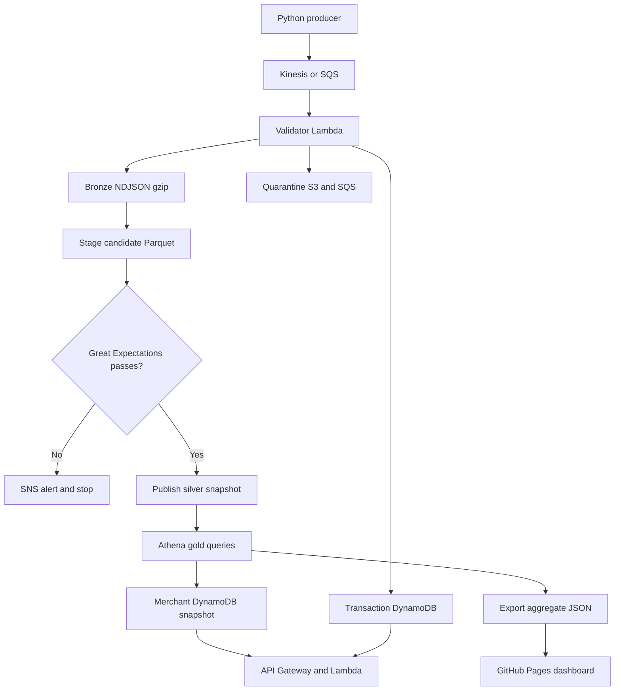

# Architecture

Step Functions drives staging, validation, silver publication, Athena aggregation, and publication to the serve store. EventBridge is disabled by default. Enable only during an intentional test window.

**Delivery contract:** at-least-once delivery, deterministic bronze object keys, immutable transaction IDs, full-snapshot deduplication, and snapshot replacement in silver and gold. This is replay-safe processing, not a distributed exactly-once transaction. DynamoDB may briefly show ACCEPTED before bronze is durable. Reprocessing repairs that boundary. Exhausted Kinesis infrastructure failures preserve the invocation payload in S3; malformed business events use quarantine plus the invalid-record SQS queue. SQS redrive may also contain exhausted infrastructure events.

**Quality boundary:** staging is outside silver. A failed GX suite writes only a quality report. Publish requires a PASS marker. Silver data is written into a new run prefix before the catalog switches locations. Old silver remains readable until that switch. All three gold tables are separate updates; there is no atomic multi-table gold transaction. The merchant API pointer switches only after all merchant items have been written. Snapshot directories and old DynamoDB merchant items remain until teardown.

**Concurrency:** a DynamoDB conditional lock serializes batch runs. The lease lasts 2 hours; state machine execution times out after 1 hour. Normal success/failure releases the lock. Hard termination needs expiry or manual recovery after verifying no active run. Do not bypass Step Functions or rerun Publish manually for an already-published run.

**Scope:** synthetic INR payments; immutable payment events (status changes need a new event ID or a future revision-aware model). Schema v2 adds nullable campaign_id. Unknown schema versions fail closed. Fraud flags are simple heuristics, not a trained model: amount >10x prior user average, or sixth and later event in a trailing 60-second window. No prior history means no amount-spike flag. Tied timestamps are ordered by transaction ID.

**Bounded batch design:** up to 10,000 retained bronze records / 16 MiB compressed per run, a 2 GiB batch Lambda, and 15-minute per-task limit. It rereads retained history to make late events and history-based flags deterministic. For larger workloads, migrate batch to Glue/PySpark, compact bronze files, and add incremental partitions and durable user features. This demo deliberately makes one gzip object per transaction for recoverable retries; small-file request overhead limits scale.
